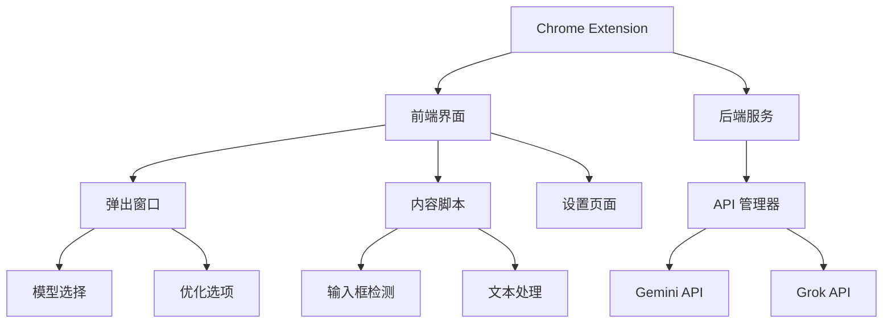

# Chrome AI文本优化插件项目计划

## 1. 项目架构



## 2. 技术栈
- 前端：
  - HTML/CSS/JavaScript
  - React.js (用于构建插件UI)
  - TypeScript (类型安全)
- 后端：
  - Node.js (API 代理服务)
  - Express.js (后端框架)
- API集成：
  - Gemini API
  - Grok API
- 开发工具：
  - Webpack (打包工具)
  - ESLint (代码规范)
  - Jest (单元测试)

## 3. 核心功能模块

### 3.1 浏览器插件基础模块
- 插件图标和弹出窗口
- 配置页面
- 快捷键支持

### 3.2 输入框检测与处理模块
- 网页输入框实时检测
- 文本选择与提取
- 优化按钮注入

### 3.3 AI 服务集成模块
- API 密钥管理
- 多模型切换支持
- 错误处理和重试机制

### 3.4 文本优化功能
- 实时优化
- 批量处理
- 历史记录

## 4. 数据流程

```mermaid
sequenceDiagram
    参与者 User as 用户
    参与者 Extension as 插件
    参与者 AI as AI服务
    
    User->>Extension: 输入文本
    Extension->>Extension: 检测输入框
    Extension->>User: 显示优化按钮
    User->>Extension: 点击优化
    Extension->>AI: 发送优化请求
    AI->>Extension: 返回优化结果
    Extension->>User: 更新输入框内容
```

## 5. 开发阶段规划

1. **Phase 1: 基础架构搭建** (预计2周)
   - 创建 Chrome 插件基本结构
   - 实现输入框检测机制
   - 搭建基础UI框架

2. **Phase 2: AI API集成** (预计2周)
   - 集成 Gemini API
   - 集成 Grok API
   - 实现模型切换功能

3. **Phase 3: 核心功能开发** (预计3周)
   - 实现文本优化功能
   - 开发设置页面
   - 添加快捷键支持

4. **Phase 4: 测试和优化** (预计1周)
   - 进行功能测试
   - 性能优化
   - Bug修复

5. **Phase 5: 发布准备** (预计1周)
   - 文档编写
   - Chrome Web Store 发布准备
   - 用户反馈机制实现

## 6. 技术难点及解决方案

1. **输入框检测**
   - 使用 MutationObserver 监听DOM变化
   - 实现智能输入框识别算法

2. **API 调用优化**
   - 实现请求队列管理
   - 添加缓存机制
   - 错误重试策略

3. **用户体验优化**
   - 添加加载动画
   - 实现防抖处理
   - 优化响应速度